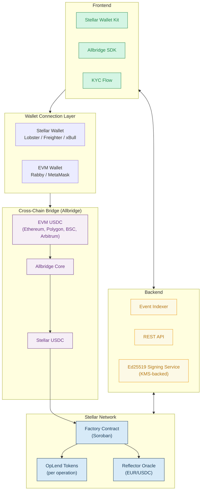
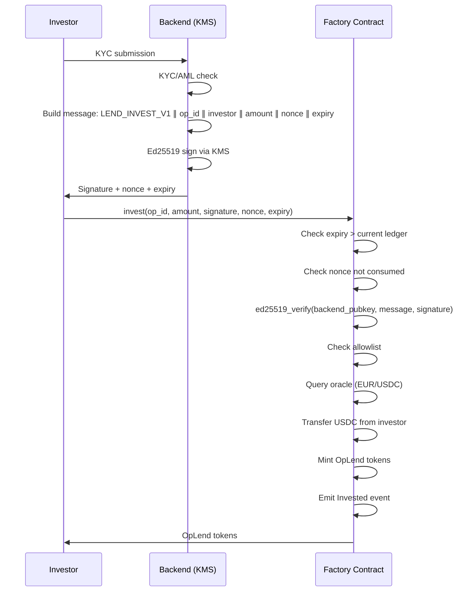
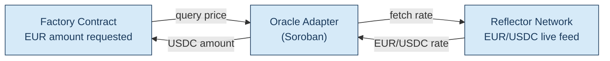
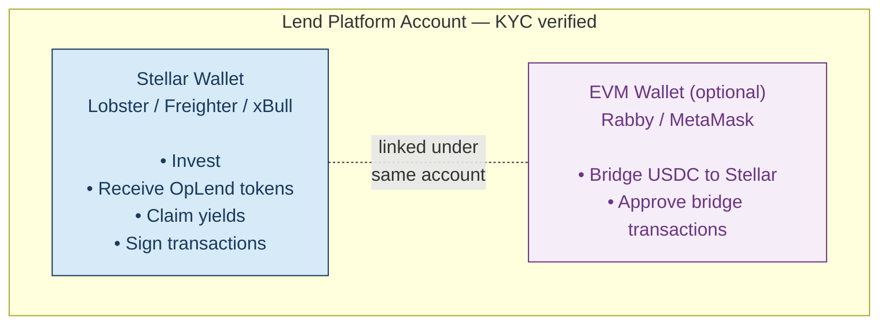
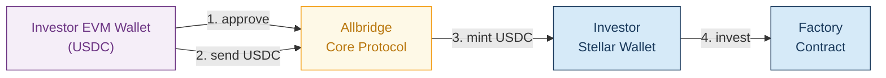
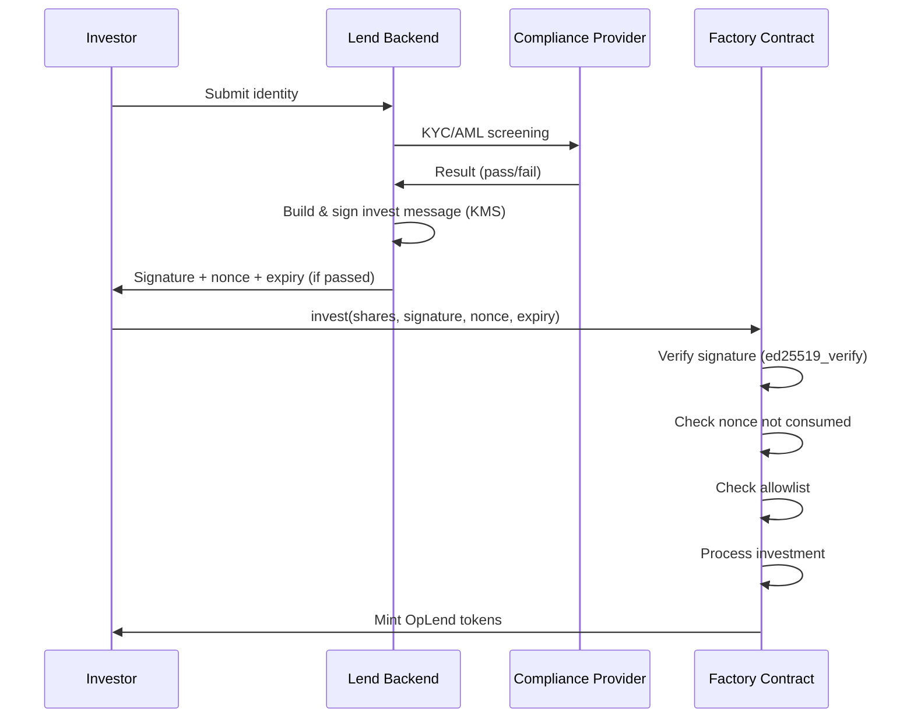
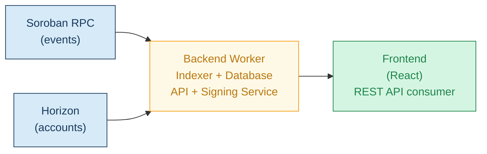
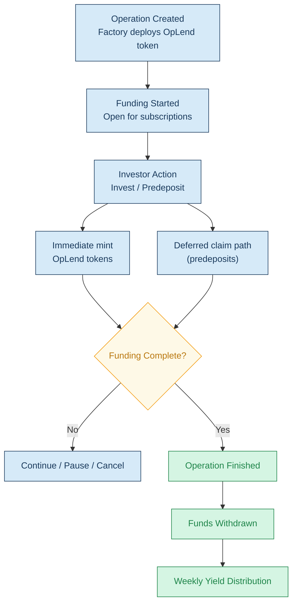

# Technical Architecture — Lend Protocol on Stellar

Lend is a compliant real estate tokenization protocol deployed on Stellar using Soroban smart contracts. The protocol enables investors to deploy stablecoins into professionally structured real estate operations, with programmable yield distribution and secondary market liquidity.

This document describes the full technical architecture of the Stellar integration.

---

## System Overview



---

## 1. Smart Contracts (Soroban)

### 1.1 Factory Contract

The Factory is the primary entry point of the protocol. It orchestrates the full lifecycle of tokenized investment operations.

**Responsibilities:**

- Create tokenized operations (deploy a new OpLend token contract per operation)
- Manage funding state (open, pause, cancel, complete)
- Process investor subscriptions with backend signature verification
- Handle pre-deposits and token claims
- Execute cancellation with automated investor refunds
- Enable fund withdrawal by the operation issuer
- Manage yield deposits and investor claim accounting
- Emit protocol events for off-chain indexing

**Key functions:**

| Function | Description | Access |
|----------|-------------|--------|
| `create_operation` | Deploy new OpLend token, register operation | Admin |
| `start_operation` | Open funding to investors | Admin |
| `invest` | Subscribe to operation (requires backend signature) | Investor (whitelisted) |
| `predeposit` | Reserve shares before operation starts | Investor (whitelisted) |
| `claim_tokens` | Claim OpLend tokens from predeposit | Investor |
| `cancel_operation` | Cancel operation, enable refunds | Admin |
| `refund` | Refund investor after cancellation | Investor |
| `withdraw_funds` | Withdraw raised capital to destination | Admin (funding-complete guard + single-withdrawal guard) |

**Investment flow — signature verification:**



### 1.2 OpLend Token Contract (SEP-41)

Each real estate operation deploys a dedicated OpLend token representing investor shares in the financing structure.

**Interface:** Implements the Soroban Token Interface ([SEP-41](https://github.com/stellar/stellar-protocol/blob/master/ecosystem/sep-0041.md)) with 9 standard functions + 6 admin functions.

**Compliance features built on [OpenZeppelin Contracts for Stellar](https://docs.openzeppelin.com/stellar-contracts):**

- **Allowlist-based transfers:** Only addresses on the allowlist can send and receive tokens. Built on OZ `Allowlist` module.
- **Blocklist enforcement:** Sanctioned or blocked addresses cannot interact with the token. Built on OZ `Blocklist` module.
- **Capped supply:** Total supply is hard-capped to the operation's funding target. Built on OZ `Capped` extension.
- **Pausable:** Emergency halt on all token operations. Built on OZ `Pausable` module.

**Transfer with compliance enforcement:**

```rust
fn transfer(e: Env, from: Address, to: MuxedAddress, amount: i128) {
    from.require_auth();
    check_nonnegative_amount(amount);
    require_not_paused(&e);
    require_allowed(&e, &from);
    require_allowed(&e, &to.address());
    require_not_blocked(&e, &from);
    require_not_blocked(&e, &to.address());

    spend_balance(&e, from.clone(), amount);
    let to_addr: Address = to.address();
    receive_balance(&e, to_addr.clone(), amount);
    events::Transfer { from, to: to_addr, to_muxed_id: to.id(), amount }.publish(&e);
}
```

**Mint with supply cap enforcement:**

```rust
fn mint(e: Env, to: Address, amount: i128) {
    check_nonnegative_amount(amount);
    let admin = read_administrator(&e);
    admin.require_auth();

    let supply = read_total_supply(&e);
    let cap = read_supply_cap(&e);
    if supply.checked_add(amount).expect("overflow") > cap {
        panic_with_error!(&e, Error::SupplyCapExceeded);
    }

    receive_balance(&e, to.clone(), amount);
    write_total_supply(&e, supply + amount);
    events::MintWithAmountOnly { to, amount }.publish(&e);
}
```

**Storage model:**

| Data | Storage Type | Rationale |
|------|-------------|-----------|
| Admin, config, supply cap | Instance | Shared across all calls, high access frequency |
| Investor balances | Persistent | Must survive archival, per-user data |
| Allowances | Persistent | With explicit `expiry_ledger` field in data — Temporary storage permanently deletes entries at TTL 0, unacceptable for securities tokens |

**Allowance structure:**

```rust
#[contracttype]
pub struct AllowanceData {
    pub amount: i128,
    pub expiry_ledger: u32, // Explicit expiration, checked on each transfer_from
}
// Key: DataKey::Allowance(AllowanceDataKey { from, spender })
// Storage: Persistent (not Temporary)
```

This avoids the silent-failure risk of Temporary storage: if a Persistent entry is archived, it is automatically restored when accessed (Protocol 23+), whereas a Temporary entry is permanently lost.

### 1.3 Oracle Integration (Reflector)

Operations are priced in EUR while investors settle in USDC. The Factory integrates [Reflector](https://reflector.network/), Stellar's native oracle network, to dynamically convert share prices.

**Flow:**

1. Operation share price is defined in EUR at creation
2. When an investor subscribes, the Factory queries the Reflector oracle adapter for the current EUR/USDC rate
3. The required USDC amount is calculated: `shares × price_per_share_eur × eur_usdc_rate`
4. The investor transfers the calculated USDC amount

**Safety mechanisms:**

- **Staleness check:** Reject if oracle `timestamp` is older than 600 seconds (~2× Reflector's refresh cadence)
- **Deviation bounds:** Reject if price deviates more than 2% between transaction simulation and execution
- **Pause fallback:** Operation can be paused if oracle is unavailable

**Implementation:**

```rust
// Reflector integration
mod reflector {
    soroban_sdk::contractimport!(file = "reflector_oracle.wasm");
}

let oracle = reflector::Client::new(&env, &oracle_address);
let price_data: PriceData = oracle.lastprice(&Asset::Other(Symbol::new(&env, "EUR")))
    .expect("Oracle price unavailable");

// Staleness check
let age = env.ledger().timestamp() - price_data.timestamp;
if age > 600 {
    panic_with_error!(&env, Error::OraclePriceStale);
}

let eur_usdc_rate = price_data.price; // Reflector returns 14-decimal fixed-point
let usdc_amount = (shares * price_per_share_eur * eur_usdc_rate) / REFLECTOR_PRECISION;
```

**Oracle addresses:**

| Network | Contract |
|---------|----------|
| Mainnet | `CAFJZQWSED6YAWZU3GWRTOCNPPCGBN32L7QV43XX5LZLFTK6JLN34DLN` |
| Testnet | `CAVLP5DH2GJPZMVO7IJY4CVOD5MWEFTJFVPD2YY2FQXOQHRGHK4D6HLP` |



---

## 2. Backend Signature & Compliance Architecture

### 2.1 Signature Scheme (Ed25519)

Every investment requires a cryptographic authorization from the backend. The backend only issues this authorization after successful KYC/AML verification. The Factory contract verifies the signature on-chain before processing the investment.

**Signed message format:**

```
LEND_INVEST_V1 || operation_id (8 bytes BE) || investor (32 bytes) || amount (16 bytes BE) || nonce (8 bytes BE) || expiry_ledger (8 bytes BE)
```

- `LEND_INVEST_V1` domain prefix prevents cross-protocol replay
- All fields are fixed-width, eliminating ambiguous parsing
- `nonce` is monotonically increasing per investor, stored on-chain after consumption
- `expiry_ledger` bounds signature validity (~1 hour at 720 ledgers × 5s)

**On-chain verification:**

```rust
// Verify backend authorization
let backend_pubkey: BytesN<32> = env.storage().instance().get(&DataKey::BackendSigner).unwrap();
let message = build_invest_message(&env, operation_id, &investor, amount, nonce, expiry);

if env.ledger().sequence() > expiry {
    panic_with_error!(&env, Error::SignatureExpired);
}

let nonce_key = DataKey::Nonce(investor.clone(), nonce);
if env.storage().persistent().has(&nonce_key) {
    panic_with_error!(&env, Error::NonceAlreadyUsed);
}

env.crypto().ed25519_verify(&backend_pubkey, &message.into(), &signature);
env.storage().persistent().set(&nonce_key, &true);
```

### 2.2 Custody Model

| Aspect | Design |
|--------|--------|
| Key type | Ed25519 keypair |
| Public key | Stored on-chain in Factory (`DataKey::BackendSigner`) |
| Private key | Cloud KMS (AWS KMS or GCP Cloud HSM), envelope encryption |
| Access control | IAM policy: only the compliance-backend service account can invoke `sign()` |
| Audit trail | All sign requests logged with investor ID, operation ID, timestamp, decision |

The backend service is stateless. It receives a KYC-check (or identification check) result from the compliance provider, evaluates rules (jurisdiction, accreditation, investment limits), and if approved, calls KMS to sign the invest message.

### 2.3 Failure & Compromise Recovery

**Signer unavailable (backend down):**
- Impact: New investments blocked. Existing tokens, transfers, refunds and yield claims all continue to function.
- Recovery: Backend deployed with redundancy (multi-AZ), auto-scaling and health checks.

**Key compromise (private key leaked):**
1. Admin calls `set_backend_signer(new_pubkey)` on Factory — immediate effect
2. All outstanding signatures (old key) become invalid — investors re-request authorization
3. Nonce tracking prevents replay of any previously issued signature
4. Exposure assessment: compromised key allows unauthorized `invest()` calls (USDC flows INTO the contract, not out — no direct fund theft)

**Key rotation procedure:**
1. Generate new keypair in KMS
2. Admin calls `set_backend_signer(new_pubkey)`
3. Backend switches to new key for all subsequent signatures
4. Old signatures fail `ed25519_verify` immediately

### 2.4 Admin Multi-Sig

| Phase | Model | Trust Surface |
|-------|-------|---------------|
| Tranche 1 | Single backend signer (KMS) + single admin | Compliance decisions centralized. Admin operations centralized. |
| Tranche 2 | Backend signer + Custom Account Contract for admin (2-of-3 multi-sig) | Admin operations require 2 of 3 independent parties to co-sign. No single party can act alone. |

**Multi-sig composition (2-of-3):**

Any critical admin operation (withdraw funds, change signer, pause, upgrade contracts) requires signatures from at least 2 of the 3 keyholders:

| Keyholder | Role | Rationale |
|-----------|------|-----------|
| **Lend core team** | Day-to-day operations, protocol management | Primary operator with domain knowledge (3 signers) |
| **Advisor / board member** | Regulatory oversight | Third party afiliated with Lend but not involved with Lend day-to-day operations |

This structure ensures that no single entity — including Lend itself — can unilaterally withdraw funds, modify compliance parameters, or upgrade contracts. The two-party threshold balances operational agility with external oversight.

**Implementation via Soroban Custom Account Contract:**

Soroban natively supports [Custom Account Contracts](https://developers.stellar.org/docs/learn/fundamentals/contract-development/authorization) implementing `__check_auth`. This enables multi-sig at the account level without wrapper contracts:

```rust
impl CustomAccountInterface for AdminMultiSig {
    type Signature = Vec<BytesN<64>>;
    type Error = AccError;

    fn __check_auth(
        env: Env,
        signature_payload: Hash<32>,
        signatures: Vec<BytesN<64>>,
        _auth_context: Vec<Context>,
    ) -> Result<(), AccError> {
        let signers: Vec<BytesN<32>> = env.storage().instance().get(&DataKey::Signers).unwrap();
        let threshold: u32 = 2; // 2-of-3
        let valid = signatures.iter().filter(|sig| {
            signers.iter().any(|pk| env.crypto().ed25519_verify(pk, &signature_payload.into(), sig).is_ok())
        }).count();
        if valid < threshold { return Err(AccError::NotEnoughSigners); }
        Ok(())
    }
}
```

---

## 3. Dual-Wallet Architecture

A key differentiator of the Lend protocol is the ability for investors to connect both a Stellar wallet and an EVM wallet under a single platform account. This enables cross-chain capital onboarding while keeping investment settlement on Stellar.

### 3.1 Wallet Connection

**Stellar wallet:**
- Connected via [Stellar Wallet Kit](https://stellarwalletskit.dev/)
- Supported wallets: Lobster, Freighter, xBull
- Used for: investing in operations, receiving OpLend tokens, claiming yields

**EVM wallet:**
- Connected via standard Web3 provider (Rabby, MetaMask)
- Used for: bridging USDC from EVM chains to Stellar via Allbridge

**Account linking:**



Both wallets are linked to the same KYC-verified identity. The Stellar wallet is the primary wallet that receives OpLend tokens and yield distributions. The EVM wallet is optional and used exclusively for cross-chain capital bridging.

### 3.2 User Flows

**Flow A — Stellar-native investor:**

1. Connect Stellar wallet via Stellar Wallet Kit
2. Complete KYC verification on platform
3. Browse available real estate operations
4. Invest USDC directly from Stellar wallet
5. Receive OpLend tokens representing investment position
6. Receive weekly yield distributions to Stellar wallet

**Flow B — Cross-chain investor (EVM → Stellar):**

1. Connect Stellar wallet via Stellar Wallet Kit
2. Connect EVM wallet via Web3 provider (Rabby, MetaMask)
3. Complete KYC verification on platform
4. Browse available real estate operations
5. Select investment amount → platform calculates USDC needed
6. Approve USDC on EVM chain
7. Allbridge bridges USDC from EVM to investor's Stellar wallet
8. Factory contract processes investment from Stellar wallet
9. Receive OpLend tokens on Stellar wallet
10. Claim yield via `claim_yield()` at any time

**Key principle:** The bridge is a one-way capital onboarding mechanism. Once USDC arrives on Stellar, all subsequent operations (investment, yield distribution, token transfers) happen natively on Stellar.

---

## 4. Cross-Chain Bridge (Allbridge Core)

### 4.1 Architecture

Allbridge Core is integrated to enable USDC transfers from EVM chains into Stellar. The bridge flow is embedded directly in the Lend frontend, presenting a seamless single-session experience.

**Supported source chains:** Ethereum, Polygon, BSC, Arbitrum

**Bridge flow:**



### 4.2 Canonical vs Wrapped USDC

USDC bridged via Allbridge arrives as Allbridge-wrapped USDC, not as canonical Stellar USDC (issuer: `GA5ZSEJYB37JRC5AVCIA5MOP4RHTM335X2KGX3IHOJAPP5RE34K4KZVN`).

**Mitigation strategy:**

- The Factory contract maintains an admin-managed allowlist of accepted USDC token addresses
- Canonical Stellar USDC is the default and always accepted
- Allbridge-wrapped USDC can be added to the allowlist after explicit due diligence on bridge risk
- The token address is verified on every `invest()` call:

```rust
let allowed_tokens: Vec<Address> = env.storage().instance().get(&DataKey::AllowedUsdcTokens).unwrap();
if !allowed_tokens.contains(&usdc_token) {
    panic_with_error!(&env, Error::UnsupportedUsdcToken);
}
```

This ensures the protocol never silently accepts an unknown or untrusted token.

### 4.3 Frontend Integration

The Allbridge SDK is integrated into the Lend frontend. The user experience is:

1. User selects an operation and investment amount
2. If paying from EVM: connect EVM wallet, approve USDC, initiate bridge
3. Frontend displays bridge progress with status updates
4. Once USDC arrives on Stellar, the investment transaction is prepared
5. User signs the Stellar transaction via Stellar Wallet Kit
6. Investment is processed by the Factory contract

The bridge and investment are presented as a single guided process, but they are technically two separate transactions (bridge + invest) to maintain clean separation of concerns.

---

## 5. Compliance Layer

### 5.1 Regulatory Framework

Lend operates under French financial regulation. Each tokenized operation requires a formal investment document (DIS — Document d'Information Synthétique) submitted to the Autorité des Marchés Financiers (AMF).

### 5.2 On-Chain Compliance

Compliance is **structural**, not declarative. It is enforced at the smart contract level:

**Allowlist/Blocklist (Factory + OpLend):**
- Only addresses on the allowlist can invest through the Factory
- Only addresses on the allowlist can receive OpLend token transfers
- Blocked addresses are excluded from all protocol interactions
- Allowlist/blocklist managed by protocol admin

**Backend Signature Authorization:**
- Every investment requires an Ed25519 signature generated by the backend (see Section 2)
- The backend only generates signatures after successful KYC/AML verification
- The Factory contract verifies the signature on-chain before processing the investment
- This creates a two-layer compliance gate: off-chain verification + on-chain enforcement

**Identity linking:**
- Each wallet address is associated with a declared identity (legal name, residential address)
- Required for regulatory compliance: each tokenized bond position must be linked to a real-world investor identity
- Sanctions and AML screening performed against relevant databases before signature generation

### 5.3 Compliance Flow



---

## 6. Yield Distribution

Lend distributes yields to investors on a weekly basis, entirely on-chain. This is a key reason for choosing Stellar: the low transaction costs (~0.00001 XLM per operation) make weekly distribution to thousands of investors economically viable.

### 6.1 Distribution Mechanism

1. Real estate operation generates revenue (rent, interest)
2. Lend's asset management team processes the revenue off-chain
3. Revenue is converted to USDC and deposited to the distribution wallet on Stellar
4. Distribution is executed proportionally to each investor's OpLend token holdings
5. USDC is sent directly to each investor's Stellar wallet

### 6.2 Transparency

All yield distributions are visible on-chain through Stellar Explorer. Investors can verify:
- Distribution frequency and amounts
- Proportional allocation relative to their holdings
- Historical distribution record

---

## 7. Attack Surface & Sequencing Strategy

### 7.1 Component Inventory & Trust Model

| Component | Trust Level | Failure Mode |
|-----------|-------------|-------------|
| Factory Contract | Trustless (code) | Smart contract bug → pause + upgrade |
| OpLend Token | Trustless (code, OZ-based) | Bug in compliance hooks → pause |
| Backend Signer | Trusted (centralized) | Down → investments blocked. Compromised → unauthorized invest (no fund theft) |
| Reflector Oracle | External trusted | Stale/wrong price → staleness check rejects, pause fallback |
| Allbridge | External trusted | Bridge exploit → only wrapped USDC affected, canonical USDC safe |
| Admin key | Trusted (centralized → multi-sig) | Compromised → full control. Mitigation: multi-sig + timelock (Tranche 2) |

### 7.2 Sequencing

The architecture is designed to be deployed incrementally, reducing attack surface at each phase:

**Tranche 1 — Stellar-native only (4 components):**
- Factory + OpLend + Backend Signer + Reflector Oracle
- Only canonical Stellar USDC accepted
- No cross-chain bridge, no dual-wallet complexity
- Focus: compliance enforcement, signature verification, yield distribution

**Tranche 2 — Cross-chain extension (+2 components):**
- Add Allbridge integration + dual-wallet
- Admin migrates to Custom Account Contract (2-of-3 multi-sig)
- Timelock on `withdraw_funds` and contract upgrades

**Rationale:** By deferring Allbridge to Tranche 2, the initial deployment eliminates bridge-related risk entirely. Tranche 1 investors interact with Stellar-native USDC only, and the attack surface is limited to on-chain contracts + one off-chain signer.

### 7.3 Mitigation Summary

| Risk | Mitigation |
|------|------------|
| Smart contract bug | OpenZeppelin Contracts for Stellar (audited base), Pausable module, WASM upgrade path, testing + fuzzing |
| Backend signer compromise | KMS custody, IAM isolation, key rotation procedure, nonce replay protection, rate limiting |
| Oracle manipulation | Staleness check (600s), deviation bounds (2%), pause fallback, accounting in USDC (oracle only for EUR conversion) |
| Bridge exploit (Tranche 2) | One-way only (onboard), USDC issuer allowlist, canonical-first strategy |
| Admin key compromise | Tranche 1: immediate risk. Tranche 2: 2-of-3 multi-sig + 48h timelock on withdrawals |
| Nonce exhaustion | 64-bit space (18.4 quintillion values per investor) |

---

## 8. Backend Worker & Event Indexing

### 8.1 Role

The backend worker maintains an accurate off-chain representation of the protocol state by continuously indexing events emitted by the Factory and OpLend contracts.

### 8.2 Data Sources

| Source | Used For |
|--------|----------|
| **Soroban RPC** (`getEvents`) | Contract events, transaction simulation, contract invocation |
| **Horizon** | Account balances, transaction history, asset metadata, network data |

### 8.3 Indexed Events

| Event | Source | Data |
|-------|--------|------|
| `OperationCreated` | Factory | Operation ID, name, total shares, price, OpLend token address |
| `OperationStarted` | Factory | Operation ID, timestamp |
| `OperationPaused` | Factory | Operation ID |
| `OperationCanceled` | Factory | Operation ID |
| `OperationFinished` | Factory | Operation ID, total funded |
| `Invested` | Factory | Operation ID, investor address, shares, USDC amount |
| `Predeposit` | Factory | Operation ID, investor address, shares |
| `ClaimedOpToken` | Factory | Operation ID, investor address, token amount |
| `Refunded` | Factory | Operation ID, investor address, USDC amount |

### 8.4 Architecture



---

## 9. Design Decisions

### Why Soroban smart contracts over Stellar Classic Assets?

Stellar supports native asset issuance through Classic Assets, but Lend chose Soroban for the following reasons:

| Requirement | Classic Assets | Soroban | Choice |
|------------|---------------|---------|--------|
| Transfer restrictions (whitelist) | Limited (authorization flags) | Full programmability | Soroban |
| Compliance hooks per transaction | Not possible | Custom logic in `invest()` | Soroban |
| Supply cap enforcement | Manual | Built into contract | Soroban |
| Operation-specific token logic | Not possible | Per-operation contract | Soroban |
| Protocol event emission | Not available | Full event system | Soroban |
| Backend signature verification | Not possible | Custom verification | Soroban |

### Why Stellar over other networks?

The primary strategic reason for choosing Stellar is its **anchor network (SEP-6/24)**.

Lend targets European and international expansion with the ambition of onboarding investors who are **not crypto-native** — institutional LPs, family offices, traditional real estate investors. These investors need regulated fiat on/off-ramps: deposit euros, invest in tokenized real estate, withdraw yields in fiat.

Stellar's anchor network provides exactly this. Multiple regulated anchors are already active across Europe and internationally, offering compliant fiat ramps integrated at the protocol level. This is a structural advantage that aligns naturally with Lend's positioning and target market.

| Factor | Relevance for Lend |
|--------|-------------------|
| **Anchor network (SEP-6/24)** | **Primary reason.** Regulated fiat on/off-ramps for non-crypto-native investors. Enables European and international expansion. No equivalent on EVM. |
| **Reflector oracle** | Native EUR/USDC oracle for EUR-denominated real estate pricing. |
| **Soroban** | Programmable compliance for regulated securities (whitelist, KYC signatures, capped supply). |
| **RWA ecosystem alignment** | Stellar's strategic focus on real-world assets (SDF 2026 roadmap: $1B in tokenized assets). |
| **Transaction costs** | Economical weekly yield distribution to large investor bases. |
| **Settlement speed** | 5-second finality for investment confirmation. |

---

## 10. Operation Lifecycle



---

## 11. Deployment Architecture

### Testnet (current)

- Factory contract deployed on Soroban testnet
- OpLend token contract deployed on Soroban testnet
- Testnet address: [`CATQIEC3UAAEPYBPFBJWHGY3WYQJJZ344NXAADZ7HWICA2SWG7NU5III`](https://testnet.stellarchain.io/contracts/CATQIEC3UAAEPYBPFBJWHGY3WYQJJZ344NXAADZ7HWICA2SWG7NU5III)
- Source code: [github.com/lendxyz/lend-contracts-soroban](https://github.com/lendxyz/lend-contracts-soroban)

### Mainnet (planned)

- Production deployment with hardened configuration
- Backend worker indexing mainnet events
- Reflector oracle on mainnet feeds (`CAFJZQWSED6YAWZU3GWRTOCNPPCGBN32L7QV43XX5LZLFTK6JLN34DLN`)
- USDC canonical issuer: `GA5ZSEJYB37JRC5AVCIA5MOP4RHTM335X2KGX3IHOJAPP5RE34K4KZVN`
- Allbridge configured for mainnet USDC
- Security review of all contract parameters completed before deployment

---

## 12. Incentive Mechanism

To encourage adoption and anchor capital on Stellar, Lend introduces a **1.25x multiplier on Lend Points** for investments executed on the Stellar instance during the first year.

This incentive is designed to:
- Position Stellar as the preferred chain for Lend investors
- Drive early adoption and long-term user anchoring
- Create a concrete mechanism for TVL growth on Stellar

At this stage, incentives are limited to points-based rewards. This grant is strictly scoped to development and does not include capital allocation for yield subsidies.
